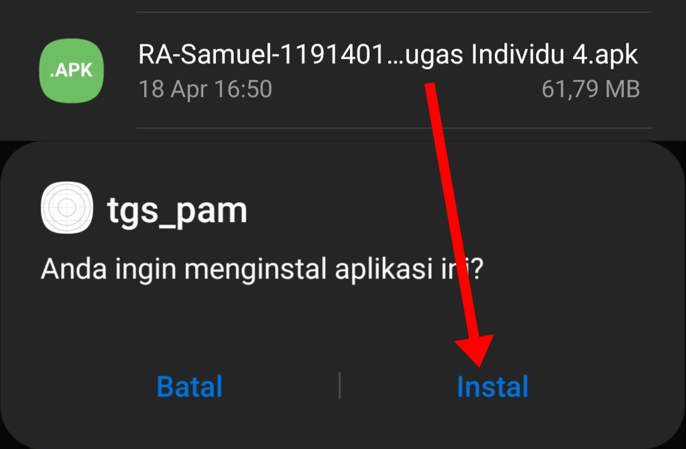
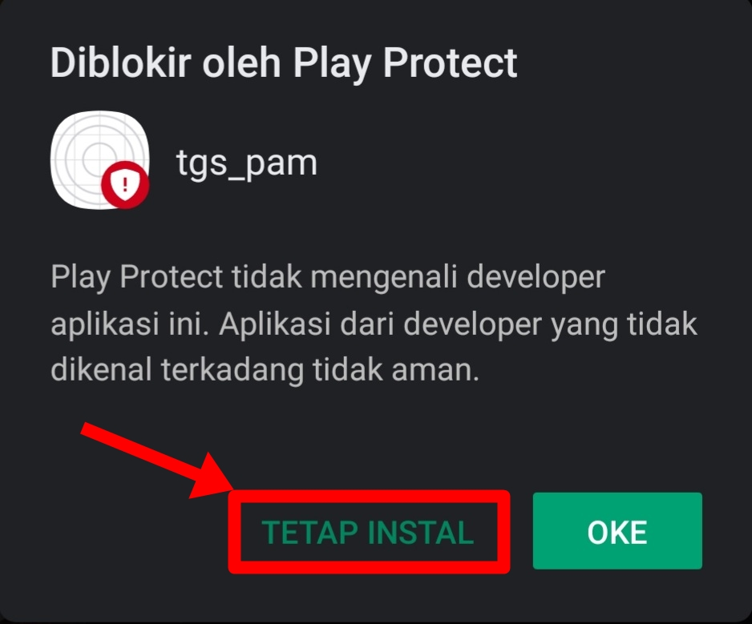
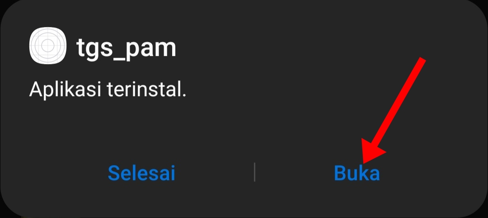
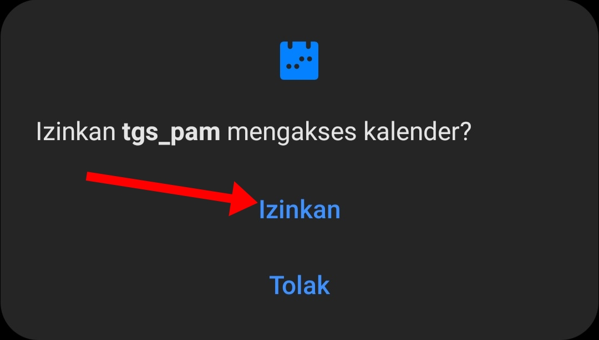
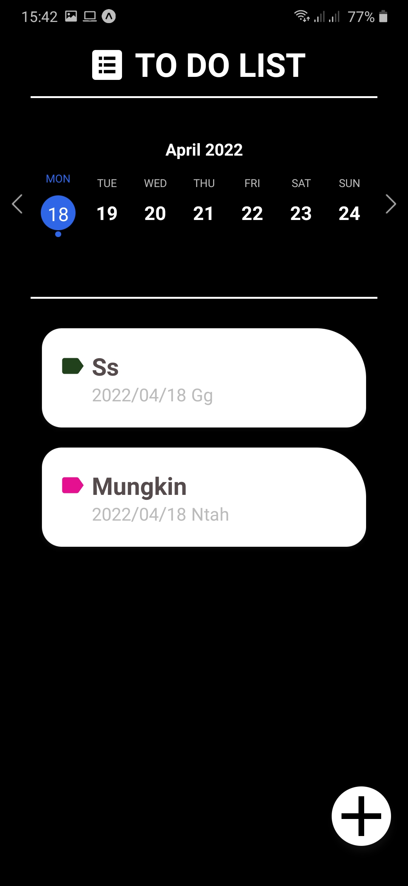
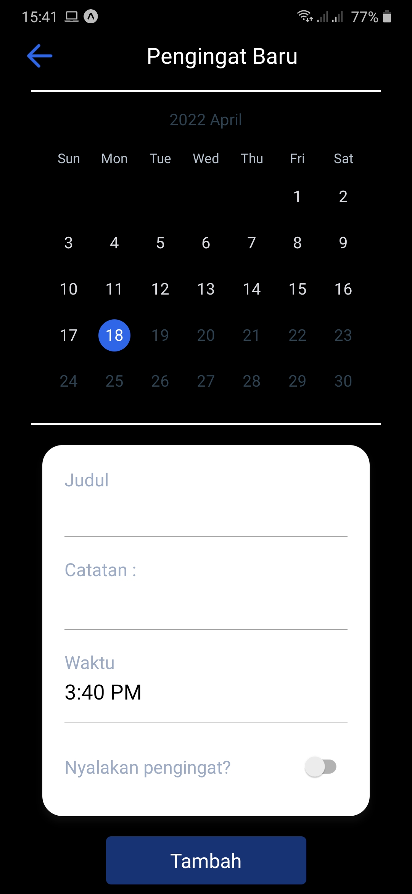
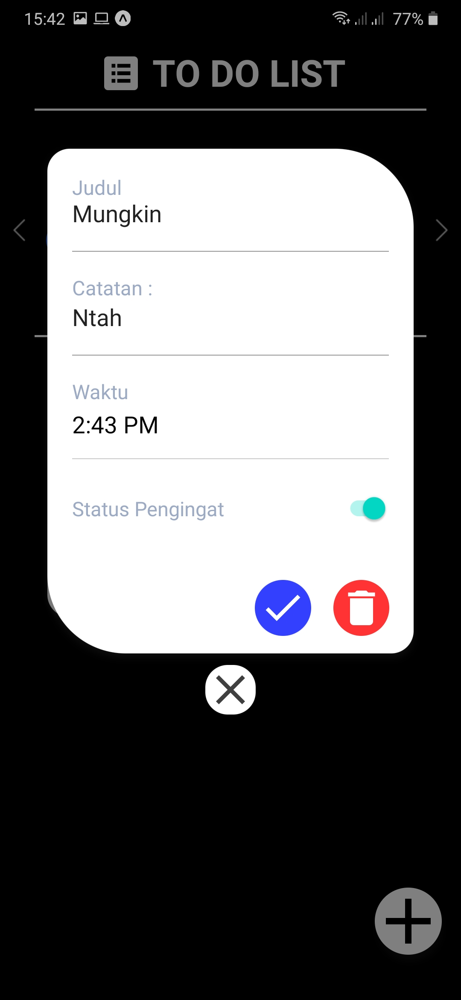

# tugas-individu-pam4
"Pemrograman Aplikasi Mobile" Individual Task 4th

# TO DO LIST App
A simple to do list app using API Expo Calendar build

# package.json
"dependencies": {  
    "@react-native-async-storage/async-storage": "~1.15.0",  
    "@react-native-community/datetimepicker": "4.0.0",  
    "@react-native-community/masked-view": "^0.1.11",  
    "@react-native-masked-view/masked-view": "0.2.6",  
    "@react-navigation/native": "^6.0.10",  
    "@react-navigation/stack": "^6.2.1",  
    "constants": "^0.0.2",  
    "expo": "~44.0.0",  
    "expo-calendar": "~10.1.0",  
    "expo-localization": "~12.0.0",  
    "expo-status-bar": "~1.2.0",  
    "expo-updates": "^0.11.6",  
    "immer": "^9.0.12",  
    "localization": "^1.0.2",  
    "moment": "^2.29.2",  
    "react": "17.0.1",  
    "react-dom": "17.0.1",  
    "react-native": "0.64.3",  
    "react-native-calendar-strip": "^2.2.5",  
    "react-native-calendars": "^1.1282.0",  
    "react-native-gesture-handler": "~2.1.0",  
    "react-native-get-random-values": "~1.7.0",  
    "react-native-ico-material-design": "^3.3.1",  
    "react-native-modal-datetime-picker": "^13.1.2",  
    "react-native-reanimated": "~2.3.1",  
    "react-native-safe-area-context": "3.3.2",  
    "react-native-screens": "~3.10.1",  
    "react-native-svg": "12.1.1",  
    "react-native-web": "0.17.1",  
    "react-tinder-card": "^1.4.5",  
    "updates": "^13.0.5",  
    "uuid": "^8.3.2",  
    "zustand": "^3.7.2"  
  },  
  "devDependencies": {  
    "@babel/core": "^7.12.9"  
  }  
  
# Installation Guide
1. Download the APK file using this link : https://github.com/samueljovial21/tugas-individu-pam4/raw/master/Apk_File/RA-Samuel-119140104-Tugas%20Individu%204.apk
2. Open and install the .apk file

3. Choose the "Keep Installing" option.  
No need to worry, there's no suspicious script in this app.  
Check the full script in this git repository  

4. After finish installing, open the app

5 Select the "Allow" option for letting the app importing calendar from the device.

# Other Details about this app :
# Home Display

# Creating New List

# List Detail Display

